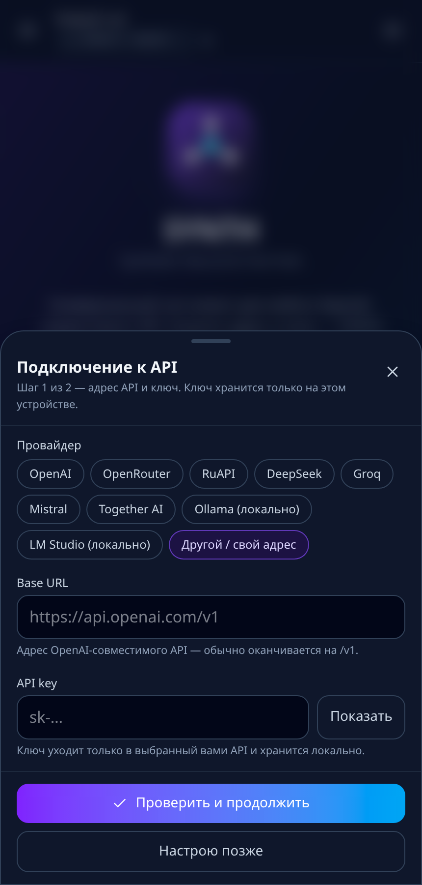
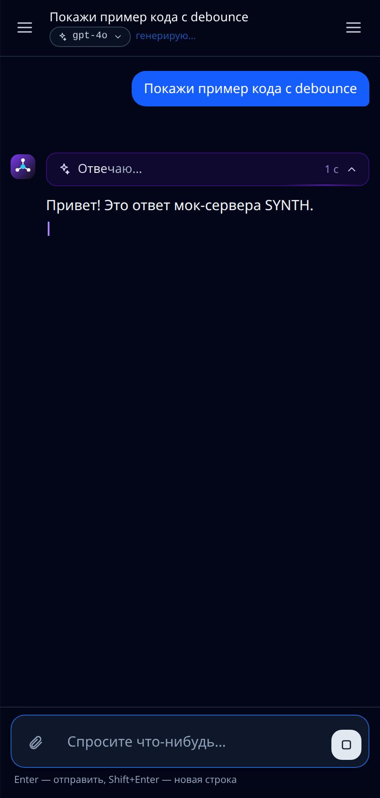
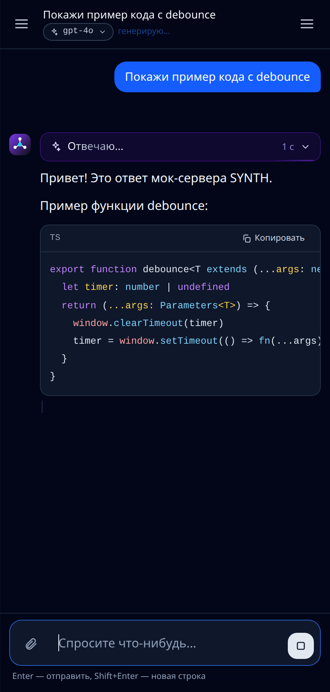

# SYNTH — Synthetic Neural & Tool Hub

Универсальный чат-клиент для любого **OpenAI-совместимого API** (`/v1/models`, `/v1/chat/completions`).
Работает как PWA в браузере и как нативное Android-приложение (Capacitor).
Приложение не привязано к конкретному провайдеру: адрес API, ключ и модели задаются
при первом запуске — OpenAI, OpenRouter, RuAPI, DeepSeek, Groq, Mistral, Together
или локальные Ollama / LM Studio.

<p align="center">
  
  
  
</p>

**Скачать:** [последний релиз](https://github.com/doc9830/SYNTH/releases/latest) — подписанный APK.
Приложение умеет само проверять обновления, качать новый APK и запускать установку.

---

## Возможности

### Чат
- **Живой стриминг**: текст печатается по мере генерации, ответ не «появляется целиком» в конце.
- **Мысли модели под катом**: `reasoning_content` / `reasoning` (DeepSeek, Claude, Gemini, o-series)
  стримится в сворачиваемый блок «Думаю… 3 с»; когда начинается ответ, блок сам сворачивается.
- **Статусы фаз** как в ChatGPT/Claude: «Готовлю ответ…», «Думаю…», «Ищу в интернете…»,
  «Читаю страницу», «Пишу код…» (по незакрытому блоку кода), «Отвечаю…».
- Markdown с подсветкой кода, копирование, таблицы, списки; правка своих сообщений и перегенерация ответа.
- История чатов в IndexedDB устройства, поиск по чатам, закрепление, экспорт в `.md`.
- Вложения-изображения (для vision-моделей), выбор и загрузка моделей списком из `/v1/models`.
- Тёмная/светлая тема, размер шрифта, «Enter — отправить», скрытие мыслей и панели инструментов.

### Инструменты модели (function calling)
- `web_search` — поиск в интернете: бесплатный без ключей (Bing RSS → DuckDuckGo → Wikipedia)
  либо Tavily / Brave / SearXNG со своим ключом.
- `read_url` — чтение страницы по ссылке: заголовок, текст, ссылки, картинки, метаданные
  (в APK — текст и структура, скриншоты страниц делает backend через headless Chrome).
- `generate_image` — генерация картинок: Images API (`/v1/images/generations`) либо
  chat-based модели, которые рисуют прямо в диалоге (Gemini Image, nano-banana).

### Обновления внутри приложения
- Проверка релизов на GitHub (троттлинг — не чаще раза в 6 часов, «Пропустить версию» запоминается).
- Диалог «Что нового» с описанием релиза, загрузка APK с прогрессом и запуск системного установщика
  (локальный плагин `SynthUpdater`, разрешение `REQUEST_INSTALL_PACKAGES`).
- В браузере вместо установки открывается страница релиза.

### Универсальность
- Любой OpenAI-совместимый провайдер: достаточно Base URL и ключа, список моделей подтягивается сам.
- Пресеты провайдеров лишь подставляют адрес и подсказку, где взять ключ.
- Режимы `direct` (браузер → API провайдера) и `proxy` (запросы через локальный backend,
  ключ не попадает в бандл).
- Нативный HTTP-мост в APK: поиск и чтение страниц работают без backend, где браузер режет CORS.

---

## Быстрый старт

```bash
npm install
npm run dev          # интерфейс: http://localhost:5173
npm run mock:api     # опционально: мок OpenAI-совместимого API на http://127.0.0.1:8799/v1
```

Мок-сервер удобен, чтобы посмотреть интерфейс без реального ключа: он отдаёт список моделей и
стримит `reasoning_content` вместе с текстом ответа и блоком кода. В мастере подключения выберите
«Другой / свой адрес» → `http://127.0.0.1:8799/v1` и введите любой ключ.

### Первый запуск

1. Откройте приложение — появится стартовый экран с кнопкой **«Настроить подключение»**.
2. Шаг 1: провайдер (или «Другой / свой адрес»), Base URL и API key.
   Кнопка «Проверить и продолжить» делает запрос `GET /v1/models`.
3. Шаг 2: модель для чата и, при желании, модель для картинок (генерация изображений выключена
   по умолчанию и включается выбором модели).
4. Готово — ключ и история остаются на устройстве.

Позже всё меняется в сайдбаре: **«Настроить подключение»** (мастер) или **«Настройки»**
(вкладки API, Web Search, Изображения, Интерфейс, Данные).

### Пресеты провайдеров

| Пресет | Base URL | Пример модели |
| --- | --- | --- |
| OpenAI | `https://api.openai.com/v1` | `gpt-4o-mini` |
| OpenRouter | `https://openrouter.ai/api/v1` | `openai/gpt-4o-mini` |
| RuAPI | `https://www.ruapi.ai/v1` | `deepseek-v4.1-flash` |
| DeepSeek | `https://api.deepseek.com/v1` | `deepseek-chat` |
| Groq | `https://api.groq.com/openai/v1` | `llama-3.3-70b-versatile` |
| Mistral | `https://api.mistral.ai/v1` | `mistral-large-latest` |
| Together AI | `https://api.together.xyz/v1` | `meta-llama/Llama-3.3-70B-Instruct-Turbo` |
| Ollama / LM Studio | `http://localhost:11434/v1`, `http://localhost:1234/v1` | локальные модели |

Список в `src/lib/providerPresets.ts` — только удобство: поддерживается любой
OpenAI-совместимый шлюз, включая собственный.

## Команды

| Команда | Что делает |
| --- | --- |
| `npm run dev` | Vite dev-сервер с HMR |
| `npm run build` | Прод-сборка (`tsc -b && vite build`) в `dist/` |
| `npm run preview` | Просмотр собранной PWA локально |
| `npm run typecheck` | Проверка типов (app + node) |
| `npm run icons` | Иконки PWA в `public/` |
| `npm run android:assets` | Иконки и сплэши Android (`mipmap-*`, `drawable-*`) |
| `npm run brand` | Иконки PWA + Android сразу |
| `npm run mock:api` | Мок OpenAI-совместимого API (порт 8799) |
| `npm run server` / `dev:api` | Локальный backend (proxy-режим, поиск, скриншоты) |
| `npm run dev:all` | Веб + backend одновременно |
| `npm run android:sync` | `npm run build` + `cap sync android` |
| `npm run android:apk` | Debug APK |
| `npm run android:release` | Подписанный release APK |
| `npm run android:install` | Сборка и установка debug APK на подключённое устройство |

---

## Структура проекта

```
src/
  api/            транспорт запросов (direct/proxy), список моделей, поиск, скриншоты
  providers/openai/   OpenAI-совместимый протокол: SSE-стрим, ошибки, генерация картинок
  providers/search/   поиск: keyless (Bing RSS → DuckDuckGo → Wikipedia), Tavily, Brave, SearXNG
  tools/          инструменты модели: web_search, read_url, generate_image
  lib/
    settings.ts       настройки (zustand + persist), isConfigured для онбординга
    providerPresets.ts пресеты провайдеров
    streamPhase.ts    фазы стрима: «Думаю…», «Пишу код…», «Ищу в интернете…»
    useChat.ts        стриминг, tool-loop, стоп/перегенерация, замер времени размышлений
    appUpdate.ts      проверка релизов GitHub, «пропустить версию», троттлинг
    updateStore.ts    состояние обновления: скачать, установить, прогресс
    nativeUpdater.ts  мост к плагину SynthUpdater (Android)
  ui/             интерфейс: WelcomeScreen, SetupDialog, ThinkingPanel, UpdateDialog, …
server/           локальный backend: proxy-режим, поиск, чтение страниц (headless Chrome)
scripts/          brand.mjs (логотип), gen-icons, gen-android-assets, mock-openai
android/          Capacitor-проект: MainActivity, UpdaterPlugin, ассеты, подпись
```

## Android

```bash
npm run android:apk        # debug APK  → android/app/build/outputs/apk/debug/
npm run android:release    # release APK → android/app/build/outputs/apk/release/
```

- `applicationId`: `app.synth.hub`, название — SYNTH, версия — `1.0.0` (`android/app/build.gradle`).
- Знак приложения — «нейронный хаб»: `scripts/brand.mjs` → `npm run brand`
  (PWA-иконки, `mipmap-*`, `ic_launcher_foreground`, сплэши).
- Подпись релиза: `android/keystore.properties` + `android/synth-release.jks` (оба в `.gitignore`).
  **Храните бэкенд-копию ключа**: обновления устанавливаются только поверх приложения,
  подписанного тем же ключом.
- Разрешение `REQUEST_INSTALL_PACKAGES` нужно для установки APK из самого приложения;
  при первом обновлении Android попросит разрешить установку неизвестных приложений для SYNTH.

Подробности сборки, подписи и разбора проблем — в [ANDROID.md](ANDROID.md).

## Обновления и релизы

Приложение проверяет `GET https://api.github.com/repos/doc9830/SYNTH/releases/latest`:

1. если `tag_name` новее встроенной версии (`src/lib/appInfo.ts` → `APP_VERSION`) и версия
   не помечена как пропущенная, показывается диалог «Доступна версия X» с описанием релиза;
2. «Скачать и установить» в APK: плагин `SynthUpdater` качает APK с прогрессом и открывает
   системный установщик; в браузере открывается страница релиза;
3. если обновлений нет, «Проверить обновления» сообщает «Установлена последняя версия».

Чтобы выпустить новую версию:

1. поднимите `version` в `package.json` (это и есть `APP_VERSION` в бандле);
2. поднимите `versionCode`/`versionName` в `android/app/build.gradle`;
3. `npm run android:release`;
4. создайте GitHub-релиз с тегом `vX.Y.Z` и приложите APK-ассет (`synth-vX.Y.Z.apk`).

## Приватность

- API-ключ хранится в `localStorage` устройства и уходит только на выбранный вами API
  (или на ваш backend в proxy-режиме).
- История чатов и изображения — в IndexedDB устройства; экспорт — вручную в `.md`.
- В proxy-режиме ключ можно держать только в `.env` на сервере: `PROVIDER_BASE_URL`,
  `PROVIDER_API_KEY` (см. `.env.example`).

## Статус и планы

- [x] Универсальное подключение (Base URL + ключ), онбординг и выбор моделей.
- [x] Живой стриминг, мысли под катом и фазовые статусы.
- [x] Инструменты: поиск, чтение страниц, генерация изображений.
- [x] Android APK, подписанные релизы и обновление из приложения.
- [ ] Автоскриншоты страниц без локального backend (Cloudflare Worker + headless Chrome).
- [ ] Синхронизация чатов между устройствами (шифрованный экспорт/импорт).

Личный проект: приложение собирается из исходников и не публикуется в сторах.
